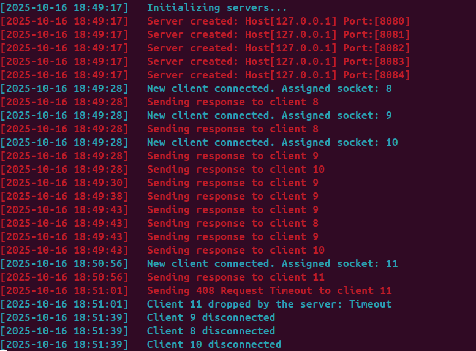

# Webserver

## 📌 Overview

This project is a simplified HTTP web server written in C++.
It implements essential features of the HTTP/1.1 protocol, allowing clients (like browsers or `curl`) to communicate with the server.
The goal of this project is to understand how web servers handle connections, parse requests, generate responses, and manage multiple clients simultaneously.

The project emphasizes **non-blocking I/O**, **poll-based event handling**, and **configurable server behavior** through a `.conf` file similar to Nginx.



## 🌟 Features

- Multiple server blocks defined in a configuration file
- Handling of HTTP/1.1 requests (GET, POST, DELETE)
- Support for multiple clients simultaneously
- CGI handling for dynamic content execution
- Error pages and status code management
- Persistent (keep-alive) connections
- Directory listing (autoindex)
- Chunked transfer encoding

## ▶️ How to run

### Compilation
```bash
git clone https://github.com/vallucodes/webserv.git
cd webserv
make
```

### Run examples
``` bash
./webserv
./webserv configs/default.conf
```

### Test with browzer curl
``` bash
curl -v localhost:8080
curl -X POST -F 'file=@test.txt' localhost:8080/upload
curl -X DELETE localhost:8080/file.txt
```

## 🛠️ Technical Implementation

| Component | Details |
|-----|----------|
| I/O Multiplexing | `poll()` for non-blocking socket operations |
| Socket Programming | `socket()`, `bind()`, `listen()`, `accept()`, `recv()`, `send()` system calls |
| HTTP Parser | Custom parser for HTTP request headers, methods, URI, and body |
| Configuration Parser | NGINX-style config file parser with lexer and syntax validation |
| Server Architecture | Multi-server support with virtual hosting capability |
| Request Handling | State machine for processing HTTP requests (reading, parsing, executing, responding) |
| Response Generation | HTTP response builder with headers and status codes |
| CGI Execution | `fork()` and `execve()` for CGI process creation, `pipe()` for communication |
| File Operations | `open()`, `read()`, `write()`, `close()` for file serving and uploads |
| Chunked Transfer | Custom parser for decoding chuked request |
| Connection Management | Keep-alive connection handling and timeout mechanisms |
| Error Handling | Comprehensive error handling for all system calls and HTTP errors |
| Memory Management | Fd cleanup in case of error for leak prevention |
| Signal Handling | Shutdown on SIGINT and SIGTERM |

## 📂 Project Structure
```
webserv/
├── Makefile
├── inc/
│   └── webserv.hpp						# Main header aggregating all includes
├── src/
│   ├── main.cpp						# Entry point
│   ├── server/
│   │   ├── Cluster.cpp					# Manages multiple Server instances
│   │   ├── Server.cpp					# Individual server object creation
│   │   └── HelperFunctions.cpp
│   ├── config/
│   │   ├── Config.cpp					# Entry point to cfg reading
│   │   ├── ConfigExtractor.cpp			# Parses config file
│   │   └── ConfigValidator.cpp			# Validates config correctness
│   ├── parser/
│   │   ├── Parser.cpp					# HTTP request parser
│   │   └── ParserUtils.cpp
│   ├── request/
│   │   └── Request.cpp					# HTTP request representation
│   ├── response/
│   │   └── Response.cpp				# HTTP response representation
│   ├── message/
│   │   └── AMessage.cpp				# Base class for Request/Response
│   └── router/
│       ├── Router.cpp					# Routes requests to handlers
│       ├── RequestProcessor.cpp		# Processes requests through pipeline
│       ├── handlers/
│       │   ├── Handlers.cpp			# GET, POST, DELETE handlers
│       │   ├── HandlerUtils.cpp		# Handler helper functions
│       │   ├── CgiExecutor.cpp			# CGI script execution
│       │   └── MultipartParser.cpp		# File upload parser
│       └── utils/
│           ├── FileUtils.cpp			# File operations
│           ├── HttpResponseBuilder.cpp	# Response construction
│           ├── StringUtils.cpp			# String manipulation
│           └── ValidationUtils.cpp
├── configs/
│   └── default.conf					# Example configurations
├── www/
│   └── webserv_project/
│       ├── index.html
│       ├── upload.html
│       ├── cgi-bin/					# CGI scripts (.py, .js)
│       ├── errors/						# Custom error pages
│       └── uploads/					# Upload directory
└── test/
    ├── unit/							# Google Test unit tests
    └── end-to-end/						# Python integration tests
